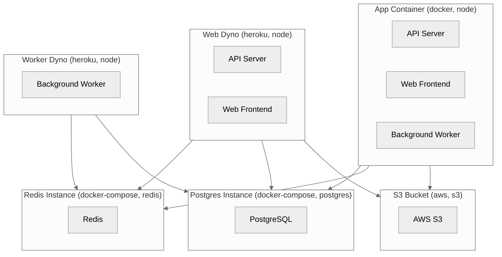

# Architecture

```mermaid
%%{init: {'theme':'neutral'}}%%
graph LR
    subgraph Web_Dyno["Web Dyno (heroku, node)"]
        subgraph Web_Frontend["Web Frontend (typescript, react)"]
            Web_Frontend_Scenes_and_Routes[/"Scenes and Routes"\]
            Web_Frontend_UI_Components[/"UI Components"\]
            Web_Frontend_Client_Stores[/"Client Stores"\]
            Web_Frontend_Client_Models[/"Client Models"\]
            Web_Frontend_Actions_and_Menus[/"Actions and Menus"\]
            Web_Frontend_Hooks_and_Utils[/"Hooks and Utils"\]
        end
        subgraph API_Server["API Server (typescript, koa, sequelize)"]
            API_Server_Routes_and_Middlewares["Routes and Middlewares"]
            API_Server_Domain_Models["Domain Models"]
            API_Server_Business_Commands["Business Commands"]
            API_Server_Authorization_Policies["Authorization Policies"]
            API_Server_Presenters["Presenters"]
            API_Server_Realtime_Collaboration["Realtime Collaboration"]
            API_Server_Transactional_Emails["Transactional Emails"]
            API_Server_Storage_Adapters["Storage Adapters"]
            API_Server_Service_Entrypoints["Service Entrypoints"]
        end
    end
    subgraph Worker_Dyno["Worker Dyno (heroku, node)"]
        subgraph Background_Worker["Background Worker (typescript, bull)"]
            Background_Worker_Queue_Processors[\"Queue Processors"/]
            Background_Worker_Tasks[\"Tasks"/]
        end
    end
    subgraph Shared_Core["Shared Core (typescript, react)"]
        Shared_Core_Editor_Framework(["Editor Framework"])
        Shared_Core_Shared_Components(["Shared Components"])
        Shared_Core_Internationalization(["Internationalization"])
        Shared_Core_Types_and_Constants(["Types and Constants"])
        Shared_Core_Utilities(["Utilities"])
    end
    subgraph Plugins["Plugins (typescript, react)"]
        Plugins_Auth_Providers(["Auth Providers"])
        Plugins_Issue_Trackers(["Issue Trackers"])
        Plugins_Content_Import_and_Embeds(["Content Import and Embeds"])
        Plugins_Analytics(["Analytics"])
        Plugins_Payments(["Payments"])
        Plugins_Enterprise_and_Infra(["Enterprise and Infra"])
    end
    subgraph CLI_Tools["CLI Tools (typescript, node)"]
        CLI_Tools_Commands>"Commands"]
    end

    PostgreSQL[("PostgreSQL")]
    Redis[("Redis")]
    AWS_S3[("AWS S3")]
    SMTP[["SMTP"]]
    Sentry[["Sentry"]]
    OAuth_Providers[["OAuth Providers"]]
    Iframely[["Iframely"]]
    Stripe[["Stripe"]]

    Web_Frontend --> Shared_Core
    Web_Frontend --> API_Server
    API_Server --> Shared_Core
    API_Server --> PostgreSQL
    API_Server --> Redis
    API_Server --> AWS_S3
    API_Server --> SMTP
    API_Server --> Sentry
    Background_Worker --> Redis
    Background_Worker --> PostgreSQL
    Background_Worker --> API_Server
    Plugins --> Shared_Core
    Plugins --> API_Server
    Plugins --> Stripe
    CLI_Tools --> API_Server
    CLI_Tools --> Shared_Core
```

---

### Web Frontend `typescript, react`

Single-page React application that renders the collaborative knowledge base UI for end users.

**Path:** `app`

**Depends on:** Shared Core, API Server

- **Scenes and Routes** — Page-level React components and route definitions for dashboard, documents, settings, and auth flows.
- **UI Components** — Reusable React components including editor, dialogs, breadcrumbs, and navigation elements.
- **Client Stores** — MobX stores that manage client-side state and sync with the backend.
- **Client Models** — Frontend data models and proxies for server entities.
- **Actions and Menus** — Command palette actions and contextual menus wired to keyboard shortcuts.
- **Hooks and Utils** — Custom React hooks and utilities for i18n, plugin management, and error reporting.

### API Server `typescript, koa, sequelize`

Node.js backend exposing REST APIs, WebSocket endpoints, and real-time collaboration services.

**Path:** `server`

**Depends on:** Shared Core, PostgreSQL, Redis, AWS S3, SMTP, Sentry

- **Routes and Middlewares** — Koa routers and middleware handling API endpoints, authentication, and rate limiting.
- **Domain Models** — Sequelize ORM models for documents, collections, users, teams, and related entities.
- **Business Commands** — Domain command handlers for creating, importing, exporting, and provisioning resources.
- **Authorization Policies** — Permission checks that gate access to resources based on user role and team membership.
- **Presenters** — Response formatters that shape API payloads returned to clients.
- **Realtime Collaboration** — Hocuspocus extensions for authenticated real-time collaborative document editing.
- **Transactional Emails** — Email templates and dispatch logic for invites, shares, and notifications.
- **Storage Adapters** — Database, Redis, and file storage (local or S3) connection adapters.
- **Service Entrypoints** — Process entrypoints for web, worker, websockets, collaboration, cron, and admin services.

### Background Worker `typescript, bull`

Bull-based job queue that processes async tasks such as exports, imports, notifications, and cleanup.

**Path:** `server/queues`

**Depends on:** Redis, PostgreSQL, API Server

- **Queue Processors** — Handlers that consume queued jobs and dispatch them to task implementations.
- **Tasks** — Individual async task implementations invoked by processors.

### Shared Core `typescript, react`

Isomorphic code shared across frontend, backend, CLI, and plugins including types, editor, and i18n.

**Path:** `shared`

- **Editor Framework** — ProseMirror-based editor infrastructure with commands, extensions, and embeds.
- **Shared Components** — React components reused between app and plugins such as icons and dialogs.
- **Internationalization** — Translation catalogues and helpers for 30+ supported languages.
- **Types and Constants** — Cross-cutting TypeScript types and application-wide constants.
- **Utilities** — Shared helpers for validation, time, formatting, and common operations.

### Plugins `typescript, react`

Pluggable integrations for auth providers, embeds, issue trackers, analytics, payments, and storage backends.

**Path:** `plugins`

**Depends on:** Shared Core, API Server, Stripe

- **Auth Providers** — OAuth and OIDC integrations including google, azure, discord, slack, oidc, email, and passkeys.
- **Issue Trackers** — Integrations with github, gitlab, linear, and jira for issue and PR embeds.
- **Content Import and Embeds** — Notion import and embed plugins for figma, iframely, and diagrams.
- **Analytics** — Analytics integrations for Google Analytics and Matomo.
- **Payments** — Stripe payments and billing integration with webhook and API routes.
- **Enterprise and Infra** — Enterprise features plus storage, search-postgres, and webhooks plugins.

### CLI Tools `typescript, node`

Command-line utilities for exporting and importing workspace data.

**Path:** `cli`

**Depends on:** API Server, Shared Core

- **Commands** — CLI entrypoints for export and import operations against the database.

---

## Deployment

**Web Dyno** `heroku, node`
: Runs the HTTP API, WebSocket server, and real-time collaboration services.
  Hosts: API Server, Web Frontend
  Depends on: Redis Instance, Postgres Instance, S3 Bucket

**Worker Dyno** `heroku, node`
: Runs the Bull background job processor for async tasks.
  Hosts: Background Worker
  Depends on: Redis Instance, Postgres Instance

**Postgres Instance** `docker-compose, postgres`
: PostgreSQL container provisioned via docker-compose for local and self-hosted deployments.
  Hosts: PostgreSQL

**Redis Instance** `docker-compose, redis`
: Redis container provisioned via docker-compose for cache, queues, and pub/sub.
  Hosts: Redis

**S3 Bucket** `aws, s3`
: S3-compatible object storage configured via environment variables.
  Hosts: AWS S3

**App Container** `docker, node`
: Multi-stage Docker image that builds and runs the full application on Node.js 24.
  Hosts: API Server, Web Frontend, Background Worker
  Depends on: Postgres Instance, Redis Instance, S3 Bucket
