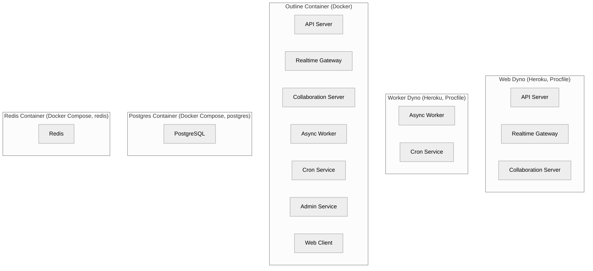

# Architecture

```mermaid
%%{init: {'theme':'neutral'}}%%
graph LR
    subgraph Web_Dyno["Web Dyno (Heroku, Procfile)"]
        subgraph API_Server["API Server (TypeScript, Node.js, Koa, Sequelize)"]
            API_Server_API_Routes["API Routes"]
            API_Server_Auth_Routes["Auth Routes"]
            API_Server_OAuth_Server["OAuth Server"]
            API_Server_MCP_Server["MCP Server"]
            API_Server_Models["Models"]
            API_Server_Migrations["Migrations"]
            API_Server_Commands["Commands"]
            API_Server_Policies["Policies"]
            API_Server_Presenters["Presenters"]
            API_Server_Middlewares["Middlewares"]
            API_Server_Emails["Emails"]
            API_Server_Onboarding_Templates["Onboarding Templates"]
            API_Server_Server_Editor_Helpers["Server Editor Helpers"]
        end
        Realtime_Gateway["Realtime Gateway (TypeScript, Socket.IO, Redis)"]
        Collaboration_Server["Collaboration Server (TypeScript, Hocuspocus, Yjs)"]
    end
    subgraph Worker_Dyno["Worker Dyno (Heroku, Procfile)"]
        subgraph Async_Worker["Async Worker (TypeScript, Bull, Redis)"]
            Async_Worker_Event_Processors[\"Event Processors"/]
            Async_Worker_Async_Tasks[\"Async Tasks"/]
            Async_Worker_Queue_Health_Monitor[\"Queue Health Monitor"/]
        end
        Cron_Service[\"Cron Service (TypeScript)"/]
    end
    subgraph Outline_Container["Outline Container (Docker)"]
        subgraph Web_Client["Web Client (TypeScript, React, MobX, Vite, Styled Components)"]
            Web_Client_Scenes[/"Scenes"\]
            Web_Client_UI_Components[/"UI Components"\]
            Web_Client_Stores[/"Stores"\]
            Web_Client_Models[/"Models"\]
            Web_Client_Routes[/"Routes"\]
            Web_Client_Editor_Bindings[/"Editor Bindings"\]
            Web_Client_Actions_and_Menus[/"Actions and Menus"\]
        end
        Admin_Service["Admin Service (TypeScript, Bull Board)"]
    end
    subgraph Plugins["Plugins (TypeScript, React)"]
        Plugins_Auth_Providers(["Auth Providers"])
        Plugins_Third_Party_Integrations(["Third-Party Integrations"])
        Plugins_Embed_Providers(["Embed Providers"])
        Plugins_Storage_Backends(["Storage Backends"])
        Plugins_Search_Backends(["Search Backends"])
        Plugins_Email_Plugin(["Email Plugin"])
        Plugins_Analytics_Plugins(["Analytics Plugins"])
        Plugins_Diagrams_Plugin(["Diagrams Plugin"])
        Plugins_Enterprise_Plugin(["Enterprise Plugin"])
    end
    subgraph Shared_Library["Shared Library (TypeScript, React, ProseMirror)"]
        Shared_Library_ProseMirror_Editor(["ProseMirror Editor"])
        Shared_Library_Shared_Components(["Shared Components"])
        Shared_Library_i18n(["i18n"])
        Shared_Library_Helpers_and_Utils(["Helpers and Utils"])
        Shared_Library_Schemas_and_Validations(["Schemas and Validations"])
    end

    PostgreSQL[("PostgreSQL")]
    Redis[("Redis")]
    Object_Storage[("Object Storage")]
    SMTP[["SMTP"]]
    OAuth_Identity_Providers[["OAuth Identity Providers"]]
    Integration_APIs[["Integration APIs"]]
    Sentry[["Sentry"]]
    Datadog[["Datadog"]]

    Web_Client --> API_Server
    Web_Client --> Realtime_Gateway
    Web_Client --> Collaboration_Server
    Web_Client --> Shared_Library
    Web_Client --> Sentry
    API_Server --> PostgreSQL
    API_Server --> Redis
    API_Server --> Object_Storage
    API_Server --> Shared_Library
    API_Server --> Async_Worker
    API_Server --> Plugins
    API_Server --> Sentry
    API_Server --> Datadog
    Realtime_Gateway --> Redis
    Realtime_Gateway --> PostgreSQL
    Realtime_Gateway --> Shared_Library
    Collaboration_Server --> PostgreSQL
    Collaboration_Server --> Redis
    Collaboration_Server --> Shared_Library
    Collaboration_Server --> API_Server
    Async_Worker --> Redis
    Async_Worker --> PostgreSQL
    Async_Worker --> Object_Storage
    Async_Worker --> SMTP
    Async_Worker --> Shared_Library
    Async_Worker --> Plugins
    Cron_Service --> Async_Worker
    Cron_Service --> Redis
    Admin_Service --> Redis
    Admin_Service --> Async_Worker
    Plugins --> API_Server
    Plugins --> Shared_Library
```

---

### Web Client `TypeScript, React, MobX, Vite, Styled Components`

Single-page web application that users interact with to read, write, and collaborate on documents.

**Path:** `app`

**Depends on:** API Server, Realtime Gateway, Collaboration Server, Shared Library, Sentry

- **Scenes** — Full-page views composed of many components (documents, settings, search, login, etc.).
- **UI Components** — Reusable React components and design primitives shared across scenes.
- **Stores** — MobX stores that fetch, cache, and mutate domain models against the backend API.
- **Models** — MobX observable domain models (documents, collections, users, comments, etc.).
- **Routes** — Async-loaded route definitions wiring scenes into the SPA.
- **Editor Bindings** — React glue around the shared ProseMirror editor for document editing.
- **Actions and Menus** — Reusable user actions and context menus driving the command palette and UI affordances.

### API Server `TypeScript, Node.js, Koa, Sequelize`

HTTP API service that authenticates users and exposes CRUD endpoints for every resource in Outline.

**Path:** `server`

**Depends on:** PostgreSQL, Redis, Object Storage, Shared Library, Async Worker, Plugins, Sentry, Datadog

- **API Routes** — REST-style endpoints for documents, collections, users, integrations, and other resources.
- **Auth Routes** — OAuth, SAML, OIDC, and email authentication entrypoints handled via Passport strategies.
- **OAuth Server** — OAuth 2.0 authorization server endpoints for third-party API clients.
- **MCP Server** — Model Context Protocol endpoint exposing Outline content to AI tools.
- **Models** — Sequelize-typescript models defining the persistent domain schema.
- **Migrations** — Sequelize migration files for evolving the PostgreSQL schema.
- **Commands** — Higher-level orchestrations that mutate multiple models within a single transaction.
- **Policies** — cancan-based authorization rules that gate every resource action.
- **Presenters** — Serializers that turn Sequelize models into the JSON shapes consumed by the client.
- **Middlewares** — Shared Koa middleware for auth, rate limiting, validation, and request context.
- **Emails** — React-based transactional email templates rendered for notifications and invites.
- **Onboarding Templates** — Markdown templates seeded into new teams as onboarding documents.
- **Server Editor Helpers** — Server-side helpers for parsing and rewriting ProseMirror documents.

### Realtime Gateway `TypeScript, Socket.IO, Redis`

Socket.IO gateway that pushes document, presence, and notification events to connected clients.

**Path:** `server/services/websockets.ts`

**Depends on:** Redis, PostgreSQL, Shared Library

### Collaboration Server `TypeScript, Hocuspocus, Yjs`

Hocuspocus server providing real-time collaborative editing of ProseMirror documents over Yjs.

**Path:** `server/collaboration`

**Depends on:** PostgreSQL, Redis, Shared Library, API Server

### Async Worker `TypeScript, Bull, Redis`

Background worker that runs Bull queue tasks and event processors triggered by API actions.

**Path:** `server/queues`

**Depends on:** Redis, PostgreSQL, Object Storage, SMTP, Shared Library, Plugins

- **Event Processors** — Handlers reacting to domain events (notifications, search indexing, backlinks, exports).
- **Async Tasks** — Standalone jobs for imports, exports, cleanups, notifications, and avatar processing.
- **Queue Health Monitor** — Watches Bull queues and surfaces stalled or failing jobs.

### Cron Service `TypeScript`

Schedules recurring maintenance jobs such as cleanups and reminder emails onto the worker queues.

**Path:** `server/services/cron.ts`

**Depends on:** Async Worker, Redis

### Admin Service `TypeScript, Bull Board`

Internal admin UI exposing Bull queue dashboards and operational tooling.

**Path:** `server/services/admin.ts`

**Depends on:** Redis, Async Worker

### Plugins `TypeScript, React`

Modular integrations bundled with Outline that extend auth, storage, search, and third-party services.

**Path:** `plugins`

**Depends on:** API Server, Shared Library

- **Auth Providers** — SSO and identity plugins (azure, google, oidc, slack, passkeys).
- **Third-Party Integrations** — Service integrations (notion, github, gitlab, linear, figma, discord, zapier, webhooks).
- **Embed Providers** — Iframely-based unfurling and rich embeds for external URLs.
- **Storage Backends** — Pluggable file storage drivers including local disk and S3-compatible providers.
- **Search Backends** — PostgreSQL-backed full-text search implementation.
- **Email Plugin** — Inbound email handling for creating documents from messages.
- **Analytics Plugins** — Frontend analytics adapters (googleanalytics, matomo, umami).
- **Diagrams Plugin** — Renders Mermaid and other diagram syntaxes inside documents.
- **Enterprise Plugin** — Features reserved for the enterprise distribution of Outline.

### Shared Library `TypeScript, React, ProseMirror`

Code shared between client and server, including the ProseMirror editor, schemas, and helpers.

**Path:** `shared`

- **ProseMirror Editor** — The collaborative document editor used by both client and server-side rendering.
- **Shared Components** — React components reused across the frontend and email rendering.
- **i18n** — i18next setup and locale catalogs for translated UI text.
- **Helpers and Utils** — Pure utility functions (text, urls, dates) safe to use on both runtimes.
- **Schemas and Validations** — Shared validation rules and zod schemas enforced on both ends of the API.

---

## Deployment

**Web Dyno** `Heroku, Procfile`
: Runs the API server, websockets gateway, and collaboration server as the public-facing process.
  Hosts: API Server, Realtime Gateway, Collaboration Server

**Worker Dyno** `Heroku, Procfile`
: Runs the async queue worker process for background jobs and scheduled tasks.
  Hosts: Async Worker, Cron Service

**Outline Container** `Docker`
: Production container image bundling the built server, plugins, and frontend assets.
  Hosts: API Server, Realtime Gateway, Collaboration Server, Async Worker, Cron Service, Admin Service, Web Client

**Postgres Container** `Docker Compose, postgres`
: Local development PostgreSQL instance defined in docker-compose.yml.
  Hosts: PostgreSQL

**Redis Container** `Docker Compose, redis`
: Local development Redis instance defined in docker-compose.yml.
  Hosts: Redis
